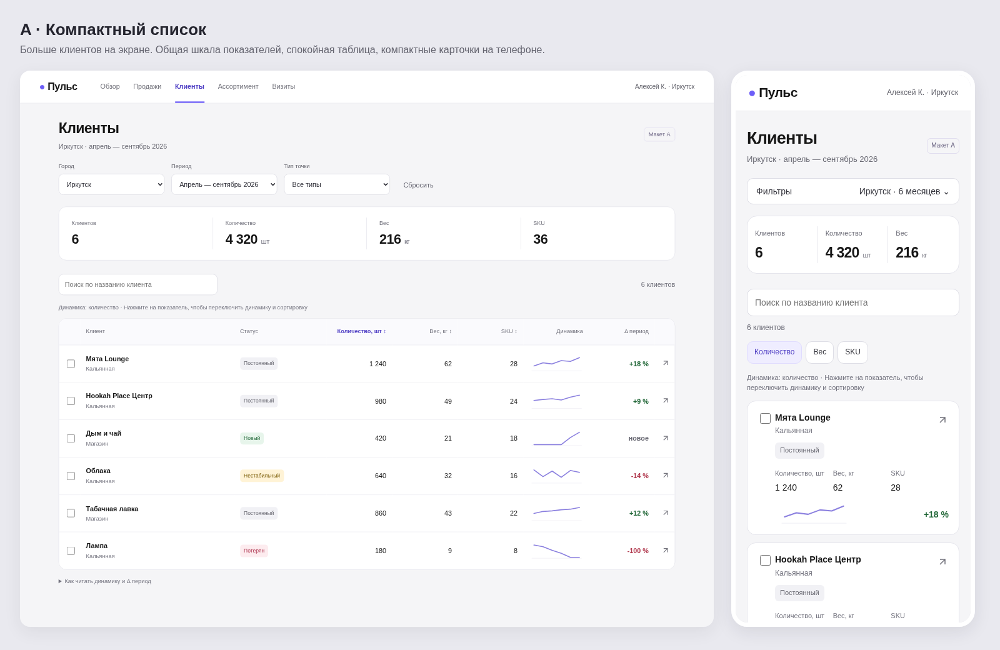
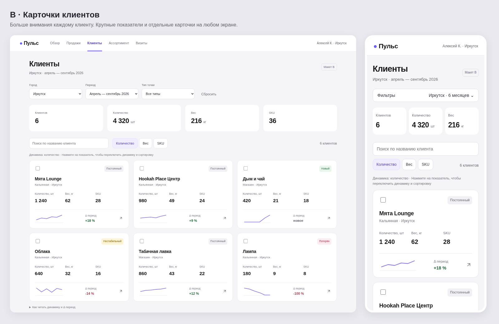

# Пульс · Клиенты: два визуальных варианта

Макеты для обсуждения. Демонстрационные данные; рабочий интерфейс приложения не изменён.

## A · Компактный список

Таблица на компьютере, компактные карточки на телефоне. Больше клиентов на экране, удобнее сравнивать показатели.

## B · Карточки клиентов

Карточки на компьютере и телефоне. Больше пространства для каждого клиента, меньше плотность списка.

## Открыть интерактивные макеты

[Скачать HTML-макеты одним архивом](https://github.com/lakalyut/sarma-crm/raw/refs/heads/design/client-concepts-2026-10-08/docs/client-concepts/pulse-client-concepts.zip)

Распакуйте архив и откройте `index.html` в браузере. Интернет не требуется. Работают поиск, фильтр типа точки, выбор клиентов, переключение динамики и сортировка. Вызов отчётов и карточки показывает пояснение вместо реальных данных. Город и период фиксированы для сравнения дизайна. Переключение метрики демонстрируется на условных графиках.

Макеты проверены на ширине 320, 390 и 1440 пикселей: без горизонтального переполнения и ошибок JavaScript. Проверены поиск, выбор клиентов и переключение показателя. Навигация в шапке — демонстрационная.
