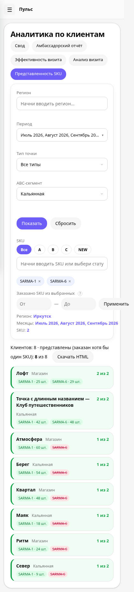
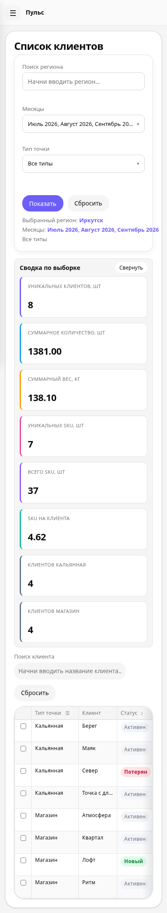
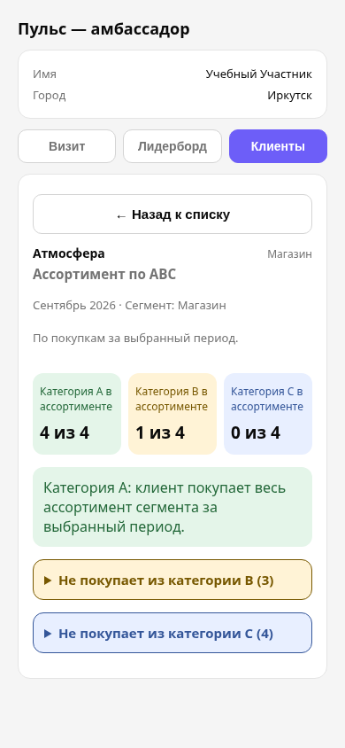

# Дизайн-ревью «Пульса»

8 октября 2026 · версия приложения `777365e` · анализ без изменений интерфейса

У «Пульса» уже есть подходящая основа: спокойный светлый интерфейс, узнаваемый фиолетовый акцент, общая боковая навигация и переиспользуемые таблицы. Для единого стиля нужно закрепить правила компонентов и привести существующие страницы к ним. Наибольший эффект дадут понятные фильтры, читаемые показатели и удобный мобильный список клиентов.

Проверены **25 экранов и вариантов доступа** в Chromium при **1440×1000** и **390×844**, сделаны 50 снимков. Дополнительно проверены пустой список и ошибки заполнения визита. Использовались реальные шаблоны и скрипты приложения, учебная SQLite-база, настоящие Chart.js и Inter. Рабочая база и Telegram-рассылки не затрагивались. Telegram SDK заменён имитацией авторизации; нативная оболочка Telegram, экранная клавиатура и тёмная тема на реальном устройстве не проверялись.

Проведены проверка клавиатуры, замеры размеров и контраста, автоматический анализ axe-core 4.10.3. Автоматические проверки не заменяют полную проверку WCAG и исследование с пользователями. «Современный дизайн» здесь оценивается по ясности, согласованности, читаемости и удобству выполнения задач, а не по модным эффектам.

## Что исправлять первым

| Приоритет | Проблема | Последствие |
| --- | --- | --- |
| P1 | Клавиатура и доступные названия элементов | Некоторые фильтры нельзя полноценно выбрать без мыши; часть кнопок и полей непонятна скринридеру |
| P1 | Контраст зелёного и вторичного текста | Показатели и подписи трудно читать; есть подтверждённые нарушения порогов контраста |
| P1 | Выход элементов за ширину телефона | Кнопки частично уходят за экран |
| P1 | Мобильная страница клиентов | До списка нужно долго прокручивать, а таблица требует горизонтальной прокрутки |
| P1 | Оформление удаления | Удаление визуально выглядит как обычное основное действие |
| P2 | Формы, ABC, карточки, термины и числовые форматы | Пользователю приходится заново интерпретировать одинаковые элементы на разных страницах |

P1 — исправить в первую очередь: мешает работе или повышает вероятность ошибки. P2 — следующий этап: системная визуальная и смысловая унификация.

## 1. Фильтры и кнопки должны работать с клавиатуры — P1

**Наблюдение.** Кастомный select получает `tabindex`, но не получает роль и состояние раскрытия. Enter открывает список, ArrowDown не выбирает следующую опцию. Это воспроизведено в форме переименования города: значение до и после последовательности Enter → ArrowDown → Enter осталось «Иркутск». Мультиселект периода раскрывается кликом по `div`, который не является обычной Tab-остановкой.

axe также нашёл неназванные чекбоксы выбора клиентов, кнопки раскрытия отчётов, поле количества участников визита и select типа точки в мини-аппе. Например, на списке из восьми клиентов восемь чекбоксов не имели доступного названия.

**Предложение.** Один доступный компонент select/multiselect для всех форм. Подписи связаны с полями; у чекбокса — «Выбрать клиента Маяк», у стрелки — «Раскрыть клиента Маяк». Реализовать клавиши выбора, Escape, управление фокусом и `aria-expanded`. Если полноценный кастомный компонент пока дорог, использовать нативный select там, где это допустимо.

Видимый фокус должен отличаться от обычной границы. Сейчас он сводится к серой обводке 1px: `#e5e5e5` на белом имеет контраст всего **1,26:1**. Предложение — отдельный контрастный focus-ring, например 2px с отступом.

**Где:** [custom_select.js:30](../../app/static/js/custom_select.js#L30), [custom_select.js:82](../../app/static/js/custom_select.js#L82), [checkbox_multiselect.js](../../app/static/js/checkbox_multiselect.js), [forms.css:48](../../app/static/css/forms.css#L48), [clients_summary.html:326](../../app/templates/analytics/clients_summary.html#L326).

**Готово, когда:** весь выбор проходит через Tab, стрелки, Enter и Escape; озвучиваются название и состояние; фокус виден; выбранное значение отправляется в форму.

## 2. Разделить цвета текста и декоративных акцентов — P1

**Подтверждённые примеры:**

| Сочетание | Контраст | Оценка для обычного мелкого текста |
| --- | ---: | --- |
| `#16a34a` на белом | 3,30:1 | Ниже 4,5:1; встречается в положительных дельтах |
| `#16a34a` на `#f0fdf4` | около 3,15:1 | Ниже 4,5:1; счётчики представленности SKU |
| `#737373` на `#f5f5f5` | 4,35:1 | Чуть ниже 4,5:1; подписи графиков и форм |
| `#6d5ef8` на `#eef2ff` | около 4,08:1 | Ниже 4,5:1; активная ссылка амбассадорской навигации |
| Белый на `#6d5ef8` | 4,56:1 | Проходит 4,5:1 для текста кнопки |
| `#236839` на `#e4f5e9` | 5,96:1 | Проходит; уже применяется в мини-аппе |

Значения округлены; axe может показывать небольшое отличие в сотых. Для крупного текста порог другой — 3:1; здесь речь о подписях 12–14px и небольших показателях. Для графической линии цвет оценивается отдельно, поэтому нельзя автоматически заменить все зелёные элементы одним тёмным цветом.

**Предложение.** Ввести `success-text`, `success-bg`, `success-border`, `primary-text`, `text-secondary`. Текст успеха темнее линии графика; активная ссылка на светлом фоне темнее основной заливки кнопки. Сохранить знак процента, букву ABC и текст статуса: смысл должен читаться без цвета.

**Где:** [base.css](../../app/static/css/base.css), [client_analysis.css:231](../../app/static/css/client_analysis.css#L231), [base_ambassador.html](../../app/templates/base_ambassador.html), [miniapp_clients.css:6](../../app/static/css/miniapp_clients.css#L6).

**Готово, когда:** обычный текст проходит 4,5:1 на всех используемых фонах; крупный текст и значимые графические элементы проверены по соответствующим порогам.

## 3. Исправить два подтверждённых мобильных переполнения — P1

При ширине окна **390px**:

- «Представленность SKU»: ширина документа **421px**. Кнопка «Применить» в диапазоне «От — До» выходит до координаты 421px.
- «Аналитика по регионам»: ширина документа **393px**. Кнопка «По регионам отдельно» выходит за экран.

Это выход управляющих элементов за страницу, а не ожидаемая горизонтальная прокрутка таблицы.

**Предложение.** Разрешить перенос строк действий. На телефоне диапазон занимает два поля в строке, кнопка — следующую строку. Переключатели графиков располагаются в адаптивной сетке или переносятся. Контейнеры получают `min-width: 0`, длинные подписи — предсказуемый перенос.

**Где:** [client_analysis.css:278](../../app/static/css/client_analysis.css#L278), [filters.css:291](../../app/static/css/filters.css#L291), [dashboard/dashboard.html](../../app/templates/dashboard/dashboard.html).

**Готово, когда:** при 320/390/768px управляющие элементы не расширяют документ и доступны без боковой прокрутки.

## 4. Мобильные «Клиенты» должны начинаться с работы с клиентами — P1

**Наблюдение.** На 390px восемь карточек сводки становятся одной длинной колонкой. Список клиентов находится далеко ниже первого экрана. Затем пользователь видит таблицу шириной **980px** внутри области **322px**: показатели, динамика и переход к карточке находятся справа, за пределами начального вида. Длинное имя обрезается, отдельной подсказки с полным названием в ячейке нет.

Таблицы могут обоснованно прокручиваться горизонтально; сам факт такого скролла не означает нарушение WCAG. Здесь проблема в том, что это основная повседневная задача на телефоне.

**Предложение.** На телефоне: компактная сводка 2–3 показателей, остальные раскрываются; поиск клиента виден раньше; строка клиента становится карточкой с именем, статусом, выбранной метрикой, дельтой и явным переходом. Сохранить выбор клиентов для отчёта. На компьютере оставить таблицу; рассмотреть закрепление имени/выбора и менее жёсткое обрезание названия. Не превращать все аналитические матрицы в карточки — для сложных сравнений таблица полезна.

**Где:** [responsive.css:201](../../app/static/css/responsive.css#L201), [tables.css](../../app/static/css/tables.css), [clients_summary.html](../../app/templates/analytics/clients_summary.html).

**Готово, когда:** клиент находится и открывается без поиска кнопки за несколькими экранами; длинное имя читается; выделение и отчёты доступны в мобильном варианте.

## 5. Удаление должно иметь отдельную визуальную роль — P1

**Наблюдение.** «Удалить данные» и «Удалить выбранный город» используют обычную фиолетовую основную кнопку. «Удалить пользователя» оформлено вторичной опасной кнопкой. Одинаковый смысл получил разные предупреждающие признаки.

**Предложение.** Одна система действий: primary — основной следующий шаг; secondary — вспомогательный; tertiary — малозначимое действие; danger — удаление. Сохранить существующие проверки и подтверждения. Перед окончательным удалением показывать выбранный город/период и масштаб операции. Красный цвет используется только для опасного действия или ошибки.

**Где:** [imports_delete.html:146](../../app/templates/admin/imports_delete.html#L146), [imports_delete.html:204](../../app/templates/admin/imports_delete.html#L204), [users_list.html:75](../../app/templates/admin/users_list.html#L75), [forms.css](../../app/static/css/forms.css).

**Готово, когда:** опасная кнопка визуально отличается от «Показать» и «Сохранить», а подтверждение конкретно описывает операцию.

## 6. Одинаковые поля и кнопки — одна семья компонентов — P2

**Замеры текущего интерфейса:**

| Компонент | Браузер | Telegram мини-апп |
| --- | --- | --- |
| Шрифт | Inter с системным fallback | Системный шрифт |
| Заголовок страницы | Обычно 24px; приветствие главной 21px | 18px |
| Поле визита | 14px, 42px высота, радиус 10px | 15px, около 42px, радиус 10px |
| Базовое поле / поле регионов | Серый фон, радиус 18px, 40px | Белый фон, рамка, радиус 10px |
| Карточка | Внешняя 24px; фильтры 16px | 14px |
| Основная кнопка | Минимум 38px, часто радиус 18px; на части экранов переопределяется | Растянута на ширину, радиус 10px |

Разница плотности между телефоном и компьютером допустима. Разница формы и состояния одного компонента внутри одного сценария — источник несогласованности.

**Предложение.** Общие токены и правила, адаптированные к среде. Поля: белая поверхность, одинаковая рамка, подпись, помощь и ошибка. Один набор состояний default / hover / focus / filled / invalid / disabled / loading. Мобильные поля ввода целесообразно сделать 16px и проверить iOS: размер ниже 16px может вызывать увеличение при фокусе; в текущем исследовании это не проверялось на устройстве. Основные сенсорные цели — ориентир 44×44px. Это удобный продуктовый ориентир; минимум WCAG 2.2 AA — 24×24px с условиями и исключениями.

**Где:** [forms.css](../../app/static/css/forms.css), [ambassadors.css:450](../../app/static/css/ambassadors.css#L450), [regions.css](../../app/static/css/regions.css), [ambassador/app.html](../../app/templates/ambassador/app.html).

## 7. Закрепить цвета и форму ABC — P2

**Наблюдение.** В общих таблицах A зелёная, B использует синий фон и фиолетовый текст, C нейтральная. В форме Telegram B фиолетовая, C серая. В Telegram-клиентах B жёлтая, C синяя. Даже внутри мини-аппа буквы выглядят по-разному. Бейджи различаются радиусом, высотой и кеглем.

**Предложение.** Один компонент ABC и NEW для всех экранов. Пример допустимой схемы: A — зелёный, B — янтарный, C — нейтральный, NEW — фиолетовый; тёмный текст на светлых фонах. Буква и название сохраняются. Автоматический ABC по весу и каталоговый ABC остаются разными методами: рядом нужны подписи метода/сегмента, а не попытка объяснить разницу только цветом.

**Где:** [tables.css:400](../../app/static/css/tables.css#L400), [ambassador/app.html:122](../../app/templates/ambassador/app.html#L122), [miniapp_clients.css:6](../../app/static/css/miniapp_clients.css#L6).

## 8. Уменьшить вложенность карточек и лишнюю визуальную плотность — P2

**Наблюдение.** На главной и в карточке клиента большой внешний белый контейнер содержит другие белые контейнеры с рамкой и тенью. Сводка клиентов — серая рамка, внутри отдельные белые плитки с цветными полосками. Мини-апп использует более лёгкие карточки. Получается несколько способов отделения одной и той же секции.

**Предложение.** Три уровня: фон страницы → секция → содержимое. Одна основная граница на уровне секции, внутренние блоки отделяются отступом или разделителем. Тени — преимущественно у всплывающих панелей, а не у каждой вложенной карточки. Основные показатели компактны; цветные полоски не используются как случайная палитра. Кегль и вес задаются ролью текста, а не отдельной страницей.

Сохраняем плотность рабочих таблиц. Увеличивать все отступы и шрифты ради «современного вида» не нужно: на аналитических страницах это ухудшит сравнение данных.

**Где:** [layout.css](../../app/static/css/layout.css), [home.css:33](../../app/static/css/home.css#L33), [ambassadors.css:141](../../app/static/css/ambassadors.css#L141), [filters.css](../../app/static/css/filters.css).

## 9. Контекст данных должен находиться рядом с показателем — P2

**Наблюдение.** Браузерная карточка клиента показывает месяцы в заголовке, но ABC отражает всю историю. «За всё время» появляется в подписи списка недостающих ароматов, а не у каждого счётчика ABC. В мини-аппе ABC ограничен выбранными месяцами. «Δ период» сравнивает последний месяц со средним предыдущих месяцев с данными; название не объясняет этот расчёт. Клик по заголовку количества/веса/SKU одновременно меняет сортировку и метрику динамики — это неочевидная связь.

**Предложение.** У каждого блока явная строка: «Покупки · вся история · сегмент …» или «Покупки · июль–сентябрь · сегмент …». У дельты — доступное объяснение формулы и состояний «новое»/«—». Выбор метрики динамики лучше сделать отдельным видимым переключателем. Сортировка остаётся отдельным действием. Формулировки «заказы» и «на полке» не взаимозаменяемы.

**Где:** [client_detail.html:260](../../app/templates/analytics/client_detail.html#L260), [clients_summary.html:494](../../app/templates/analytics/clients_summary.html#L494), [clients_summary.html:649](../../app/templates/analytics/clients_summary.html#L649), [miniapp_clients.js:115](../../app/static/js/miniapp_clients.js#L115).

## 10. Упростить термины, навигацию и применение фильтров — P2

**Наблюдение.** «Поиск региона» и «Выбранный регион» в списке клиентов означают город. В региональной аналитике доступны и объединённые регионы, и города. Пара «Клиенты» / «По клиентам» в меню ведёт на разные по назначению страницы, но названия близки. Где-то фильтр применяется кнопкой, где-то автоматически при смене выбора; в представленности SKU есть и «Показать», и «Применить».

**Предложение.** Город называть городом. Развести «Клиенты» и «Отчёты по клиентам» или «Аналитика клиентов». Закрепить контракт: данные обновляются после общей кнопки «Показать» либо сразу; отдельные исключения явно объясняются. Для многочисленных фильтров — разделение основных и дополнительных, компактная строка активных условий, один понятный сброс. На телефоне дополнительные фильтры можно раскрывать.

**Где:** [clients_summary.html](../../app/templates/analytics/clients_summary.html), [sidebar.html](../../app/templates/includes/sidebar.html), [client_analysis.html](../../app/templates/analytics/client_analysis.html), [events.html](../../app/templates/events/event_log.html).

## 11. Единые форматы чисел и правил графиков — P2

**Наблюдение.** На главной вес округляется в короткую запись, в сводке клиентов — `1381.00`, `138.10`, в дельтах — целый процент. Некоторые строки показывают технический SKU вроде `SARMA-6` вместо аромата. Это не обязательно ошибка данных, но визуально затрудняет чтение и подбор позиции.

**Предложение.** Общие форматтеры русской локали: разделитель тысяч, запятая дробной части, осмысленная точность, единицы в заголовке или рядом с числом. Целые количества не обязательно показывать с `.00`, но дробные исходные значения сохраняются. Для ароматов основной текст «Бренд — Аромат», технический SKU — вторичная информация там, где сопоставление позволяет это сделать.

Для графиков: одинаковая цветовая роль метрик, формат подсказок, единицы осей и понятное сравнение периодов. Мини-график дополняется текстовым показателем; значения не должны зависеть только от цвета. У загружаемой и отсутствующей серии есть объяснение, а не пустое место.

## 12. Зафиксировать дизайн-систему в коде и документации — P2

В `base.css` уже есть полезные токены. Однако сейчас **17 CSS-файлов**, общая оболочка подключает 13 из них на каждой странице, а мини-апп задаёт отдельную большую таблицу стилей. В 33 из 55 HTML-шаблонов найдено 135 inline-атрибутов `style`. Размеры текста в общих CSS имеют 17 разных числовых вариантов, включая 11,5/12,5/13,5/14,5px. Это инвентаризация, а не доказательство, что каждый вариант плох.

**Предложение.** Общее основание tokens → primitives → components → page layout. Специальная раскладка остаётся локальной; внешний вид кнопок/полей/бейджей задаётся компонентом. Inline-стили автономных HTML-экспортов могут быть оправданы; не удалять их механически. Не переписывать всё на новый фреймворк ради унификации.

`CLAUDE.md` ссылается на `DESIGN.md`, но такого файла в текущем репозитории нет. Нужно создать реальную короткую спецификацию: компоненты, состояния, токены, мобильные правила, примеры и критерии проверки. Иначе новые страницы снова будут расходиться.

## Предлагаемый визуальный стандарт

Это направление для реализации, не уже внесённый редизайн.

| Область | Предлагаемое правило |
| --- | --- |
| Палитра | Сохранить фиолетовый бренд, нейтральные поверхности; тёмные семантические цвета текста |
| Типографика | Общая семья Inter/system; основной текст 14px desktop, 16px mobile; заголовок 24px; секция 16px; подписи 12–13px с достаточным контрастом |
| Числа | 24px для главных KPI; табличные цифры одинаковой ширины; русская локаль |
| Отступы | Шкала 4 / 8 / 12 / 16 / 24 / 32px |
| Скругления | Поля 10px; кнопки 10–12px; секции 16px; бейджи 6px; полный радиус только у чипов/аватаров, где он имеет смысл |
| Поля | Белая поверхность, рамка, одинаковые состояния и подписи; высота 40px desktop, целевая область около 44px mobile |
| Карточки | Меньше вложенных рамок и теней; одна граница секции, внутренние разделители |
| Действия | Primary / secondary / tertiary / danger; одна основная операция на локальный блок |
| Мобильные данные | Клиентские карточки для оперативной работы; сложные матрицы остаются таблицами с закреплённым контекстом |
| Telegram | Та же семантика и компоненты; адаптация к теме, безопасным отступам и клавиатуре после проверки на устройстве |

## Порядок реализации

1. **Основание и исправления P1:** контраст, фокус, клавиатура, доступные подписи, переполнения, опасные действия. Закрепить токены и короткую спецификацию.
2. **Эталонные компоненты:** поле, select/multiselect, кнопка, вкладки, бейдж, карточка показателя, сообщение, empty/loading/error. Проверить их на одной обычной форме и форме визита.
3. **Эталонная страница «Клиенты»:** фильтры, компактная мобильная сводка, динамика/дельта, выбор клиентов, список/таблица, карточка клиента. Это даст наиболее заметный рабочий эффект.
4. **Перенос правил:** аналитические вкладки, графики, регионы, лидерборд, затем административные страницы и мини-апп. Работа порциями без изменения прав доступа и расчётов.
5. **Проверка на устройствах:** Telegram iOS/Android, клавиатура, длинные названия, большая выборка, пустые/ошибочные данные, масштабирование.

Сроки без прототипа компонентов и выбранного объёма не оценивались. Начать лучше с эталонных «Клиентов», одновременно выполнив технические исправления P1.

## Критерии приёмки будущих изменений

- Не меняются бизнес-расчёты и доступ пользователей.
- Совпадают смысл, форма и состояния одинаковых компонентов.
- При 320/390/768/1440px управляющие элементы не расширяют документ; табличный скролл остаётся внутри области таблицы.
- Основные сценарии доступны с клавиатуры и имеют доступные названия; фокус не теряется после обновления.
- Контраст проверен по типу элемента; цвет не является единственным носителем смысла.
- Длинные названия, большие числа, отсутствие продаж и незавершённый период читаются без догадок.
- Ошибка ввода объяснена текстом, связана с полем и помогает исправить его; существующее перемещение к первому неверному полю сохраняется.
- При увеличении текста/масштаба не исчезают действия; iOS/Android проверяются отдельно.

## Материалы проверки

- `review.html` — автономное визуальное ревью с фильтром приоритетов, галереей и предложением стиля компонентов.
- `screenshots/` — 52 снимка реального локального интерфейса на учебных данных.
- `measurements.json` — размеры, вычисленные стили и результаты axe для 50 основных снимков.
- `keyboard-check.json` — воспроизведение выбора кастомного select с клавиатуры.
- `overflow-elements.json` — элементы, выходящие за ширину телефона.

Никакие изменения дизайна приложения в рамках этого ревью не реализованы.
